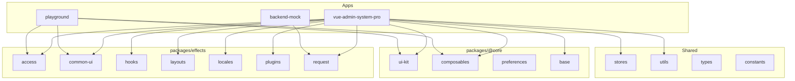

# Vben Admin Monorepo - AGENTS.md

## 项目架构

Monorepo 使用 **pnpm workspaces** + **turbo** 管理多包项目。

### 核心目录

```
apps/                          # 业务应用
├── vue-admin-system-pro/      # 主应用 (Vue 3 + Ant Design Vue)
├── backend-mock/              # Mock 服务 (nitro/h3)
playground/                    # 开发预览应用
packages/                      # 共享包
├── @core/                     # 核心包 (@vben/* 别名)
│   ├── base/                  # 基础工具 (icons, typings, shared)
│   ├── composables/           # 组合式函数
│   ├── preferences/           # 用户偏好设置
│   └── ui-kit/                # UI 组件套件 (shadcn-ui, menu-ui, design)
├── effects/                   # 功能包
│   ├── access/                # 权限控制
│   ├── common-ui/             # 通用 UI 组件
│   ├── hooks/                 # 生命周期 hooks
│   ├── layouts/               # 布局组件
│   ├── locales/               # 国际化
│   ├── plugins/               # 插件 (echarts, vxe-table, motion)
│   ├── preferences/           # 偏好设置
│   └── request/               # HTTP 请求 (axios 封装)
├── constants/                 # 常量定义
├── stores/                    # Pinia 状态管理
├── types/                     # TypeScript 类型定义
├── utils/                     # 工具函数
internal/                      # 内部工具配置
├── vite-config/               # Vite 配置共享
├── tsconfig/                  # TypeScript 配置
├── tailwind-config/           # Tailwind CSS 配置
├── lint-configs/              # ESLint/Stylelint/Commitlint 配置
```

## 关键命令

```bash
pnpm install                   # 安装依赖 (仅 pnpm，preinstall 强制检查)
pnpm dev                       # 启动所有开发服务器
pnpm dev:system-admin          # 仅启动 vue-admin-system-pro
pnpm build                     # 构建所有包
pnpm build:system-admin        # 仅构建 vue-admin-system-pro
pnpm check                     # 运行所有检查 (type/circular/dep/cspell)
pnpm lint                      # 代码检查
pnpm format                    # 代码格式化
pnpm test:unit                 # 单元测试 (vitest)
pnpm test:e2e                  # E2E 测试 (playwright)
pnpm commit                    # 交互式提交 (czg)
```

## 包管理规范

- **强制使用 pnpm**：根目录 `.npmrc` 和 `preinstall` 脚本禁止其他包管理器
- **工作区协议**：`workspace:*` 用于本地包引用
- **Catalog 模式**：依赖版本在 `pnpm-workspace.yaml` 的 `catalog:` 中集中管理

## 代码质量

### Lint/Format 工具链

- **oxfmt** + **oxlint**：主格式化/检查工具
- **eslint**：JS/TS/Vue 检查
- **stylelint**：样式检查
- **commitlint**：提交信息规范 (Angular Convention)
- **cspell**：拼写检查

### Git Hooks (lefthook)

提交前自动运行格式化 + lint + 检查，提交时验证 commit message。

## 测试

- Vitest + happy-dom 用于单元测试
- Playwright 用于 E2E 测试
- 测试文件命名：`*.test.ts`, `*.spec.ts`, `**/e2e/**`

## 环境变量

```
apps/vue-admin-system-pro/.env              # 通用变量
apps/vue-admin-system-pro/.env.development  # 开发环境
apps/vue-admin-system-pro/.env.production   # 生产环境
apps/vue-admin-system-pro/.env.analyze      # 构建分析
playground/.env*                            # Playground 环境变量
```

## 开发约定

### 路径别名

应用内使用 `#/` 指向 `src/` 目录 (在 `tsconfig.json` 和 `package.json` imports 中定义)。

### 添加新页面

1. 创建组件：`src/views/{module}/{page}/index.vue`
2. 添加路由：`src/router/routes/modules/{module}.ts`
3. 国际化：添加翻译到 `src/locales/langs/{zh-CN|en-US}/`

### API 定义

使用 `requestClient` (基于 axios) 在 `src/api/` 下按模块组织。

### CRUD 页面模式

参考 `src/views/system/role/` 结构：

- `data.ts` - 表格列和表单 Schema 定义
- `list.vue` - 列表页面
- `modules/form.vue` - 表单抽屉组件

## 技术栈

- **框架**: Vue 3.5 + Vite 8 + TypeScript 6
- **UI**: Ant Design Vue 4 + VXE Table
- **状态**: Pinia 3 + vue-i18n 11 + vue-router 5
- **构建**: vite + tsdown
- **样式**: Tailwind CSS 4 + SCSS
- **包管理**: pnpm 10 + turbo 2

## 架构图



## 参考文档

- [App 级别 AGENTS.md](./apps/vue-admin-system-pro/AGENTS.md) - 主应用详细开发指南
- [Vue Vben Admin 官方文档](https://doc.vben.pro/)
- [pnpm workspaces](https://pnpm.io/workspaces)
- [turbo](https://turbo.build/)
