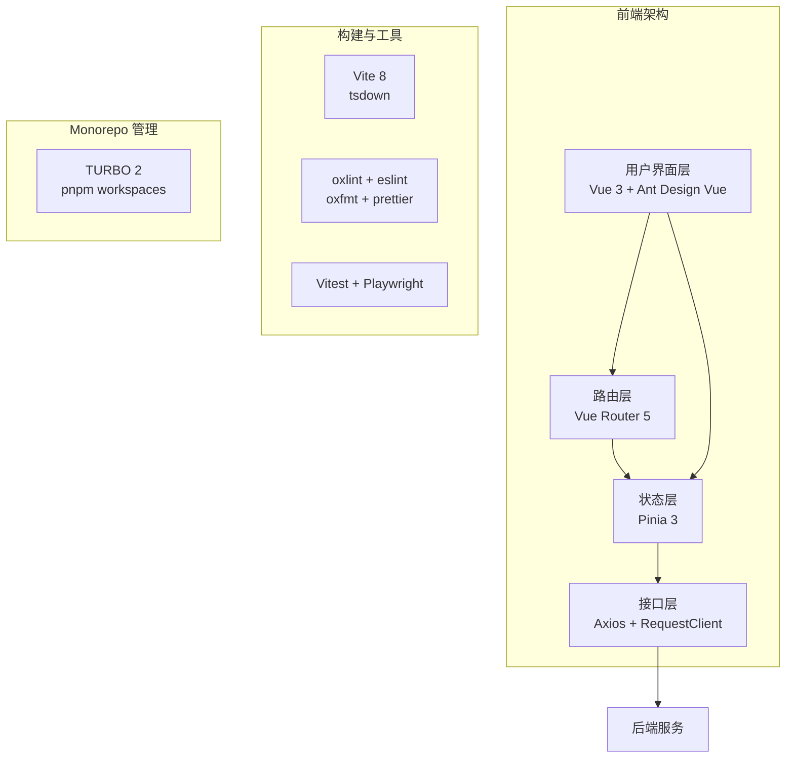

# 前端文档目录索引

## 文档概述

本文档为 vue-vben-admin 衍生项目 **vue-admin-system-pro** 的前端技术文档归档索引，采用结构化编号组织，便于系统性查阅与版本追踪。

## 文档结构

| 编号 | 文档名称 | 说明 |
| :-: | --- | --- |
| 00 | [目录索引](./00-目录索引.md) | 文档导航与更新记录 |
| 01 | [项目概述与业务背景](./01-项目概述与业务背景.md) | 产品定位、目标用户、核心功能路径图 |
| 02 | [本地开发与协作指南](./02-本地开发与协作指南.md) | 包管理规范、Git 提交规范、代码格式化 |
| 03 | [技术栈与依赖清单](./03-技术栈与依赖清单.md) | 框架版本、UI 组件库定制、核心插件说明 |
| 04 | [目录结构与模块划分](./04-目录结构与模块划分.md) | src/ 目录组织、命名规范、公共资源划分 |
| 05 | [路由管理与页面组织](./05-路由管理与页面组织.md) | 动态路由实现、权限路由拦截、页面层级 |
| 06 | [状态管理与数据流](./06-状态管理与数据流.md) | Store 结构设计、持久化机制、跨组件通信 |
| 07 | [组件体系与 UI 规范](./07-组件体系与UI规范.md) | 基础组件库、业务组件划分、原子设计 |
| 08 | [API 请求层设计](./08-API请求层设计.md) | Axios 封装逻辑、TS 类型定义、拦截器 |
| 09 | [样式管理与主题方案](./09-样式管理与主题方案.md) | CSS 预处理器、Design Tokens、深色模式 |
| 10 | [业务逻辑封装](./10-业务逻辑封装.md) | 核心自定义 Hooks、公共 Utils 工具函数 |
| 11 | [构建与工程化配置](./11-构建与工程化配置.md) | Vite 构建流程、环境变量注入、分包策略 |
| 12 | [性能优化实践](./12-性能优化实践.md) | 资源懒加载、首屏优化、虚拟列表 |
| 13 | [异常捕获与监控](./13-异常捕获与监控.md) | Error Boundary、运行时崩溃防护、埋点监控 |
| 14 | [安全防御与权限控制](./14-安全防御与权限控制.md) | 鉴权流程、按钮级权限指令、XSS 防护 |
| 15 | [测试策略与用例](./15-测试策略与用例.md) | 测试框架选择、组件测试、E2E 测试 |
| 16 | [部署发布与演进路线](./16-部署发布与演进路线.md) | 容器化部署、CDN 缓存策略、技术债 |

## 架构总览图

## 更新记录

| 日期 | 版本 | 更新内容 | 作者 |
| :-: | :-: | --- | :-: |
| 2026-05-06 | 1.0.0 | 初始版本，完成文档框架搭建与核心章节编写 | OpenCode Agent |

## 快速链接

- [项目 README](../../README.md)
- [App 级开发指南](../../apps/vue-admin-system-pro/AGENTS.md)
- [Vue Vben Admin 官方文档](https://doc.vben.pro/)
- [Vue Vben Admin GitHub](https://github.com/vbenjs/vue-vben-admin)
