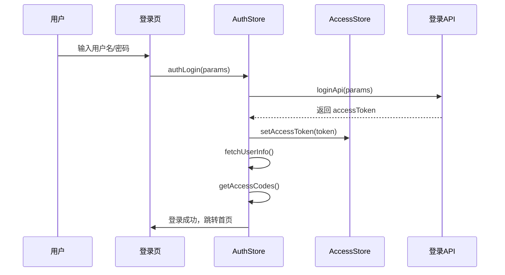
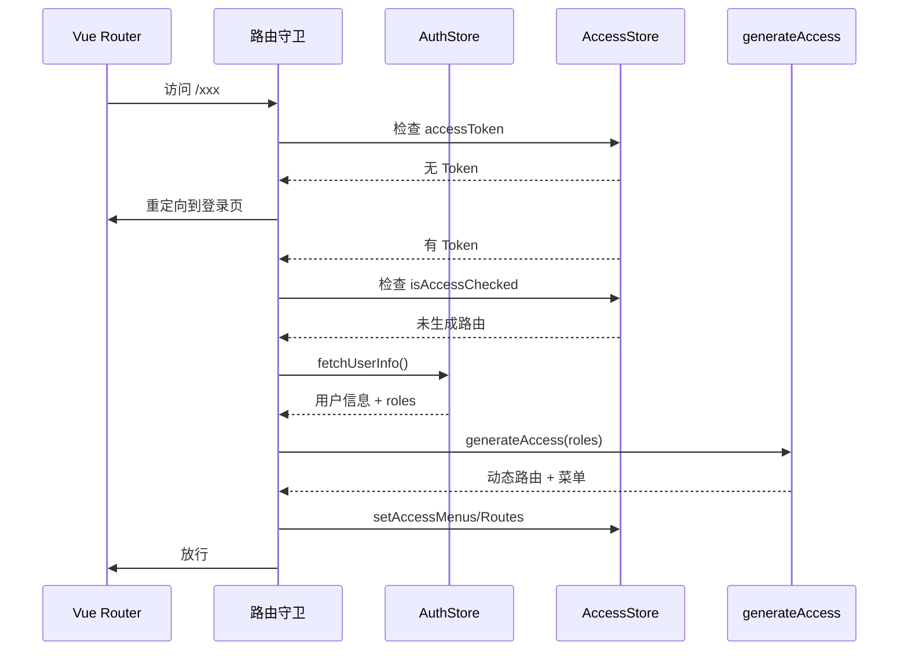

# 01 - 项目概述与业务背景

## 1.1 项目基本信息

| 属性       | 值                                                 |
| ---------- | -------------------------------------------------- |
| 项目名称   | vue-admin-system-pro                               |
| 基于框架   | vue-vben-admin 5.x (开源中后台管理系统)            |
| 技术栈核心 | Vue 3.5 + Vite 8 + TypeScript 6 + Ant Design Vue 4 |
| 许可证     | Apache License 2.0                                 |
| 作者       | Lypxc                                              |
| 仓库       | github.com/panxiaochao/vue-admin-system-pro        |

## 1.2 产品定位

vue-admin-system-pro 是基于 vue-vben-admin 5.0 定制的中后台管理系统模板，旨在提供开箱即用的企业级前端解决方案。核心定位：

- **通用性**：适用于各类企业管理系统（ERP、OA、CRM、B2B 等）
- **规范性**：遵循前端工程化最佳实践，代码结构清晰可维护
- **扩展性**：基于 Monorepo 架构，便于多应用拆分与复用

## 1.3 目标用户

| 用户角色       | 使用场景                             |
| -------------- | ------------------------------------ |
| 前端开发工程师 | 系统功能开发、组件复用、技术方案选型 |
| 后端开发工程师 | API 接口联调、前后端数据格式确认     |
| 产品经理       | 功能流程确认、权限配置验证           |
| 项目经理       | 技术架构了解、团队协作规范参照       |

## 1.4 核心功能模块

```mermaid
graph TD
    subgraph "系统管理"
        A1[用户管理] --> A[系统管理]
        A2[角色管理] --> A
        A3[菜单管理] --> A
        A4[部门管理] --> A
    end

    subgraph "权限管理]
        B1[用户权限] --> B[权限管理]
        B2[角色权限] --> B
        B3[组织架构] --> B
        B4[岗位管理] --> B
    end

    subgraph "系统设置]
        C1[参数设置] --> C[系统设置]
        C2[字典管理] --> C
        C3[在线用户] --> C
    end

    subgraph "日志管理]
        D1[登录日志] --> D[日志管理]
        D2[操作日志] --> D
    end

    subgraph "业务功能]
        E1[数据分析] --> E[业务功能]
        E2[示例页面] --> E
    end
```

### 模块详情

| 模块 | 路径 | 功能描述 |
| --- | --- | --- |
| 系统管理 | `/system/role`, `/system/menu`, `/system/dept` | 角色、菜单、部门 CRUD |
| 权限管理 | `/system-plus/permission/*` | 用户、角色、组织架构、岗位管理 |
| 系统设置 | `/system-plus/settings/*` | 参数配置、字典管理 |
| 日志管理 | `/system-plus/log/*` | 登录日志、操作日志查询 |
| 数据分析 | `/exchange/analysis` | 数据分析 Dashboard |
| 示例页面 | `/demos/*`, `/examples/*` | 功能演示与示例 |

## 1.5 核心功能路径图

### 用户登录流程



### 页面访问权限流程



## 1.6 技术架构概览

```mermaid
graph TB
    subgraph "表现层"
        Vue[Vue 3.5]
        AntDesign[Ant Design Vue 4]
        TailwindCSS[Tailwind CSS 4]
    end

    subgraph "状态层"
        Pinia[Pinia 3]
        VueRouter[Vue Router 5]
    end

    subgraph "请求层"
        Axios[Axios]
        RequestClient[RequestClient]
    end

    subgraph "构建层"
        Vite[Vite 8]
        Turbo[Turbo 2]
        pnpm[pnpm 10]
    end

    subgraph "共享包]
        Core[@vben/core]
        Effects[@vben/effects]
        UIKit[@vben/ui-kit]
    end

    Vue --> Pinia
    Vue --> VueRouter
    Vue --> AntDesign
    AntDesign --> TailwindCSS
    Pinia --> Axios
    Axios --> RequestClient
```

## 1.7 关键入口文件

| 文件路径             | 职责                             |
| -------------------- | -------------------------------- |
| `index.html`         | 应用 HTML 入口，`#app` 挂载点    |
| `src/main.ts`        | 应用初始化入口，偏好设置加载     |
| `src/bootstrap.ts`   | Vue 实例创建，插件注册，路由挂载 |
| `src/app.vue`        | 根组件                           |
| `src/preferences.ts` | 项目级偏好配置覆盖               |

## 1.8 关键配置

### 环境配置

```bash
# .env (通用配置)
VITE_APP_TITLE='Admin System'
VITE_APP_NAMESPACE=admin-system-pro
VITE_APP_STORE_SECURE_KEY=please-replace-me-with-your-own-key

# .env.development
VITE_PORT=5777
VITE_GLOB_API_URL=/api
VITE_PROJECT_API_URL=http://localhost:8081
VITE_NITRO_MOCK=true

# .env.production
VITE_GLOB_API_URL=https://mock-napi.vben.pro/api
VITE_ROUTER_HISTORY=hash
VITE_COMPRESS=none
```
