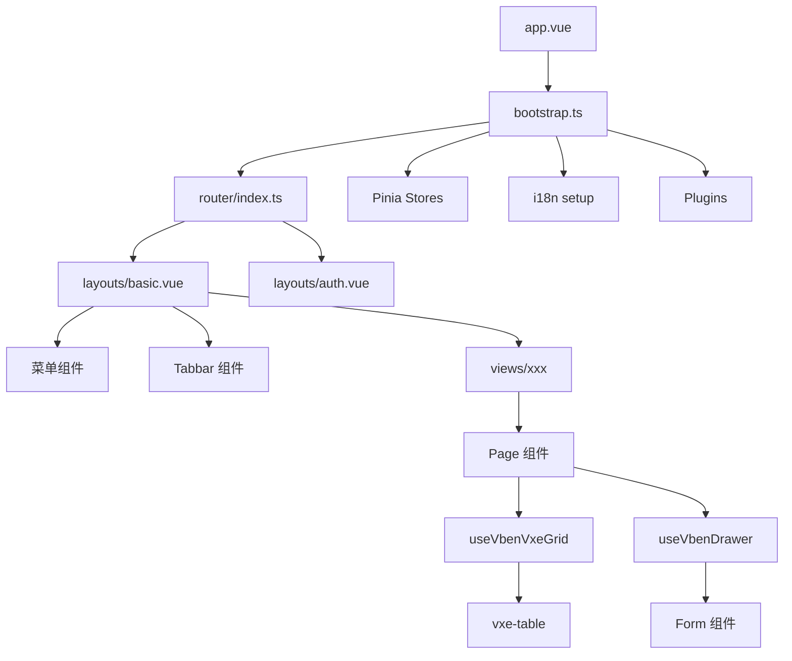

# 04 - 目录结构与模块划分

## 4.1 项目根目录结构

```
vue-vben-admin/
├── apps/                          # 业务应用
│   ├── vue-admin-system-pro/      # 主应用
│   └── backend-mock/              # Mock 服务 (nitro/h3)
├── packages/                      # 共享包
│   ├── @core/                     # 核心包
│   ├── effects/                   # 功能包
│   ├── stores/                    # 状态管理
│   ├── utils/                     # 工具函数
│   ├── types/                     # 类型定义
│   ├── constants/                 # 常量
│   ├── locales/                   # 国际化
│   ├── icons/                     # 图标
│   ├── styles/                    # 样式
│   └── preferences/               # 偏好设置
├── internal/                      # 内部工具配置
│   ├── vite-config/               # Vite 配置共享
│   ├── tsconfig/                  # TypeScript 配置
│   ├── tailwind-config/           # Tailwind CSS 配置
│   └── lint-configs/              # ESLint/Stylelint/Commitlint
├── playground/                    # 开发预览应用
├── scripts/                       # 构建脚本
├── frontend-docs/                 # 前端文档
├── pnpm-workspace.yaml            # pnpm 工作区配置
├── turbo.json                     # Turbo 构建配置
├── package.json                   # 根包配置
└── AGENTS.md                      # Agent 指令文件
```

## 4.2 应用目录结构 (vue-admin-system-pro)

```
apps/vue-admin-system-pro/
├── index.html                     # HTML 入口
├── vite.config.mts                # Vite 配置
├── package.json                   # 应用包配置
├── tsconfig.json                  # TypeScript 配置
├── .env                           # 通用环境变量
├── .env.development               # 开发环境变量
├── .env.production                # 生产环境变量
└── src/
    ├── main.ts                    # 应用入口
    ├── bootstrap.ts               # 启动引导
    ├── app.vue                    # 根组件
    ├── preferences.ts             # 偏好配置
    ├── timezone-init.ts           # 时区初始化
    ├── api/                       # API 接口
    │   ├── index.ts               # API 统一导出
    │   ├── request.ts             # 请求客户端
    │   ├── core/                  # 核心 API (登录等)
    │   │   ├── auth.ts
    │   │   ├── login.ts
    │   │   ├── menu.ts
    │   │   ├── timezone.ts
    │   │   └── user.ts
    │   ├── system/                # 系统管理 API
    │   │   ├── dept.ts
    │   │   ├── menu.ts
    │   │   └── role.ts
    │   ├── system-plus/           # 扩展系统 API
    │   │   ├── development/
    │   │   ├── log/
    │   │   ├── monitor/
    │   │   ├── permission/
    │   │   ├── settings/
    │   │   └── tenant/
    │   └── examples/              # 示例 API
    ├── router/                    # 路由配置
    │   ├── index.ts               # 路由创建
    │   ├── guard.ts               # 路由守卫
    │   ├── access.ts              # 权限生成
    │   └── routes/
    │       ├── index.ts           # 路由汇总
    │       ├── core.ts            # 核心路由
    │       └── modules/           # 路由模块
    │           ├── dashboard.ts
    │           ├── demos.ts
    │           ├── examples.ts
    │           ├── exchange.ts
    │           ├── system.ts
    │           ├── system-plus.ts
    │           └── vben.ts
    ├── store/                     # 本地 Store
    │   ├── index.ts
    │   └── auth.ts                # 认证 Store
    ├── locales/                   # 国际化
    │   ├── index.ts
    │   └── langs/
    │       ├── zh-CN/
    │       │   ├── demos.json
    │       │   ├── examples.json
    │       │   ├── exchange.json
    │       │   ├── page.json
    │       │   ├── system.json
    │       │   └── system-plus.json
    │       └── en-US/
    ├── layouts/                   # 布局组件
    │   ├── index.ts
    │   ├── basic.vue              # 基础布局
    │   └── auth.vue               # 认证布局
    ├── adapter/                   # 组件适配器
    │   ├── component/
    │   │   ├── index.ts
    │   │   └── antd_use.ts        # Ant Design 懒加载
    │   ├── form.ts                # 表单适配
    │   └── vxe-table.ts           # 表格适配
    ├── utils/                     # 工具函数
    │   ├── download-helper.ts
    │   └── error-helper.ts
    └── views/                     # 页面组件
        ├── _core/                 # 核心页面
        │   ├── about/
        │   ├── authentication/    # 登录相关
        │   │   ├── login.vue
        │   │   ├── code-login.vue
        │   │   ├── qrcode-login.vue
        │   │   ├── register.vue
        │   │   └── forget-password.vue
        │   ├── fallback/          # 错误页面
        │   │   ├── not-found.vue
        │   │   ├── forbidden.vue
        │   │   ├── internal-error.vue
        │   │   ├── coming-soon.vue
        │   │   └── offline.vue
        │   └── profile/           # 个人中心
        ├── dashboard/             # 仪表盘
        │   ├── analytics/
        │   └── workspace/
        ├── system/                # 系统管理
        │   ├── role/
        │   ├── menu/
        │   └── dept/
        ├── system-plus/           # 扩展系统
        │   ├── development/       # 开发工具
        │   ├── permission/        # 权限管理
        │   ├── settings/          # 系统设置
        │   ├── log/               # 日志管理
        │   ├── monitor/           # 监控管理
        │   └── tenant/            # 租户管理
        ├── demos/                 # 功能演示
        │   ├── access/
        │   ├── breadcrumb/
        │   ├── features/
        │   └── nested/
        ├── examples/              # 示例页面
        │   ├── form/
        │   ├── modal/
        │   ├── drawer/
        │   ├── vxe-table/
        │   └── ...
        └── exchange/              # 业务功能
            └── analysis/
```

## 4.3 关键目录说明

### 路径别名

| 别名      | 指向                                     | 使用场景   |
| --------- | ---------------------------------------- | ---------- |
| `#/`      | `apps/vue-admin-system-pro/src/`         | 应用内导入 |
| `@vben/*` | `packages/@vben/*` 或 `packages/@core/*` | 共享包导入 |

```json
// apps/vue-admin-system-pro/package.json
{
  "imports": {
    "#/*": "./src/*"
  }
}
```

## 4.4 模块划分原则

### 按业务领域划分

| 目录                 | 职责         | 说明                             |
| -------------------- | ------------ | -------------------------------- |
| `api/core/`          | 核心接口     | 登录、刷新 Token、用户信息、菜单 |
| `api/system/`        | 系统管理     | 角色、菜单、部门 CRUD            |
| `api/system-plus/`   | 扩展系统     | 权限、租户、设置、日志、监控     |
| `views/system/`      | 系统管理页面 | 角色、菜单、部门管理页面         |
| `views/system-plus/` | 扩展系统页面 | 更复杂的权限配置页面             |

### 按功能类型划分

| 目录       | 职责       | 说明                 |
| ---------- | ---------- | -------------------- |
| `adapter/` | 组件适配层 | 统一不同 UI 库的 API |
| `layouts/` | 布局组件   | 页面骨架             |
| `store/`   | 本地状态   | 业务特定状态         |
| `utils/`   | 工具函数   | 通用工具             |

## 4.5 核心文件说明

### 入口与初始化

| 文件 | 职责 |
| --- | --- |
| `index.html` | HTML 入口，`#app` 挂载点，标题由 `%VITE_APP_TITLE%` 注入 |
| `src/main.ts` | 应用初始化入口，加载偏好设置，调用 bootstrap |
| `src/bootstrap.ts` | Vue 实例创建，插件注册，路由挂载 |
| `src/app.vue` | 根组件 |
| `src/preferences.ts` | 项目级偏好配置覆盖 |
| `src/timezone-init.ts` | 时区处理初始化 |

### 路由与权限

| 文件 | 职责 |
| --- | --- |
| `src/router/index.ts` | 创建 Vue Router 实例，支持 hash/history 模式 |
| `src/router/guard.ts` | 路由守卫：登录拦截、权限校验、动态路由生成 |
| `src/router/access.ts` | 调用 `generateAccess` 生成动态路由和菜单 |
| `src/router/routes/index.ts` | 汇总 coreRoutes 和动态路由模块 |
| `src/router/routes/core.ts` | 核心路由：Root、Auth、404 |
| `src/router/routes/modules/*.ts` | 业务路由模块，按需懒加载 |

### 状态管理

| 文件                | 职责                                   |
| ------------------- | -------------------------------------- |
| `src/store/auth.ts` | 认证状态：login、logout、fetchUserInfo |

## 4.6 CRUD 页面结构模式

参考 `src/views/system/role/`：

```
src/views/system/role/
├── data.ts           # 表格列定义、表单 Schema
├── list.vue          # 列表页面
└── modules/
    └── form.vue      # 表单抽屉组件
```

### data.ts 结构

```typescript
// 表格列定义
export function useColumns(): VxeTableGridOptions['columns'] {
  return [
    { field: 'name', title: '名称', width: 200 },
    { field: 'status', title: '状态', width: 100 },
    { field: 'operation', title: '操作', width: 130, cellRender: {...} },
  ];
}

// 表单 Schema
export function useFormSchema(): VbenFormSchema[] {
  return [
    { component: 'Input', fieldName: 'name', label: '名称', rules: 'required' },
  ];
}

// 搜索表单 Schema
export function useGridFormSchema(): VbenFormSchema[] {
  return [{ component: 'Input', fieldName: 'name', label: '名称' }];
}
```

## 4.7 组件层级



## 4.8 命名规范

### 文件命名

| 类型     | 规范                   | 示例                 |
| -------- | ---------------------- | -------------------- |
| 组件文件 | PascalCase + index.vue | `RoleList/index.vue` |
| 工具文件 | camelCase              | `download-helper.ts` |
| 类型文件 | `.d.ts` 或 `types.ts`  | `user.types.ts`      |
| 样式文件 | SCSS + BEM             | `button.scss`        |

### 目录命名

| 类型     | 规范       | 示例                         |
| -------- | ---------- | ---------------------------- |
| 业务模块 | kebab-case | `system-role`, `user-manage` |
| 组件目录 | PascalCase | `FormDrawer`, `DataTable`    |
| 工具目录 | kebab-case | `utils`, `helpers`           |
