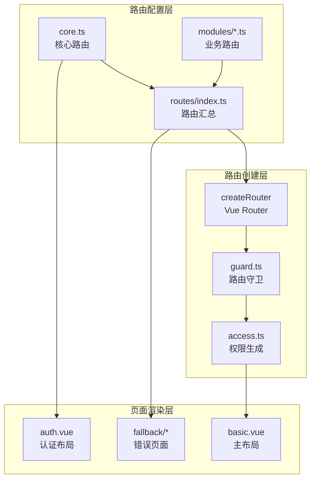
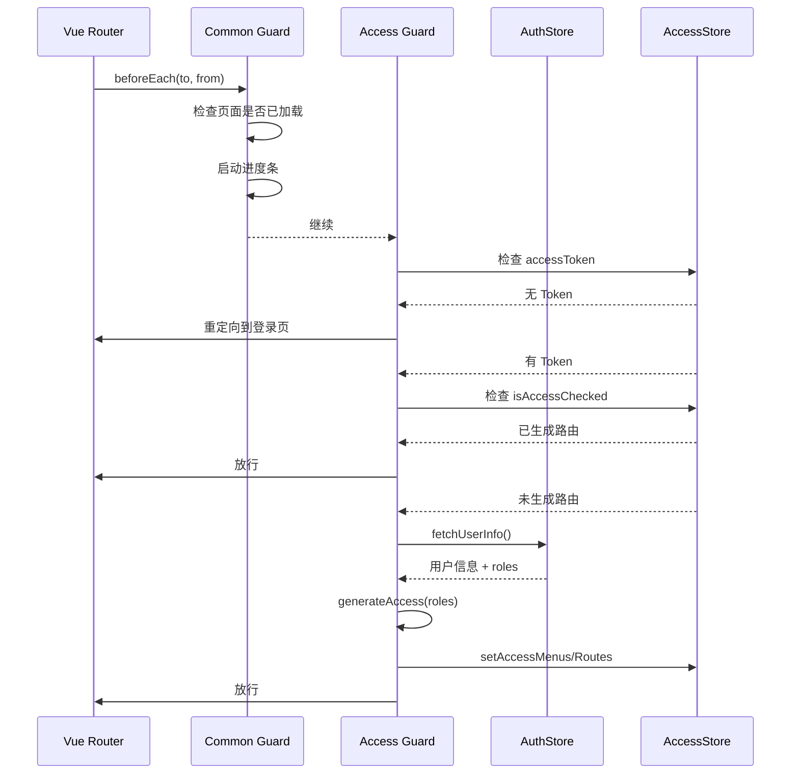
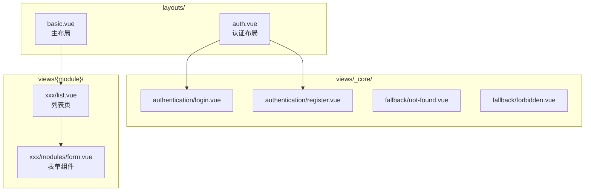
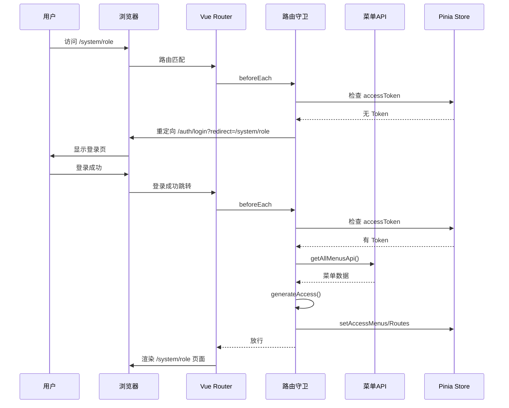

# 05 - 路由管理与页面组织

## 5.1 路由架构概览



## 5.2 路由类型划分

| 路由类型                      | 说明                 | 是否需要权限 |
| ----------------------------- | -------------------- | ------------ |
| **核心路由 (coreRoutes)**     | Root、Auth、404      | 否           |
| **外部路由 (externalRoutes)** | 可不显示在菜单中     | 否           |
| **静态路由 (staticRoutes)**   | 一直显示在菜单       | 是           |
| **动态路由 (dynamicRoutes)**  | 根据用户权限动态生成 | 是           |

```typescript
// src/router/routes/index.ts
const routes: RouteRecordRaw[] = [
  ...coreRoutes, // 核心路由
  ...externalRoutes, // 外部路由
  fallbackNotFoundRoute, // 404
];

const accessRoutes = [...dynamicRoutes, ...staticRoutes];
```

## 5.3 核心路由定义

### 根路由与布局

```typescript
// src/router/routes/core.ts
{
  component: BasicLayout,  // () => import('#/layouts/basic.vue')
  name: 'Root',
  path: '/',
  redirect: preferences.app.defaultHomePath,  // 默认首页
}
```

### 认证路由

```typescript
{
  component: AuthPageLayout,  // () => import('#/layouts/auth.vue')
  name: 'Authentication',
  path: '/auth',
  redirect: LOGIN_PATH,
  children: [
    { path: 'login', component: () => import('#/views/_core/authentication/login.vue') },
    { path: 'code-login', component: () => import('#/views/_core/authentication/code-login.vue') },
    { path: 'qrcode-login', component: () => import('#/views/_core/authentication/qrcode-login.vue') },
    { path: 'forget-password', component: () => import('#/views/_core/authentication/forget-password.vue') },
    { path: 'register', component: () => import('#/views/_core/authentication/register.vue') },
  ]
}
```

### 404 兜底路由

```typescript
const fallbackNotFoundRoute = {
  component: () => import('#/views/_core/fallback/not-found.vue'),
  meta: { hideInBreadcrumb: true, hideInMenu: true, hideInTab: true },
  name: 'FallbackNotFound',
  path: '/:path(.*)*',
};
```

## 5.4 业务路由模块

### 路由模块示例

```typescript
// src/router/routes/modules/system.ts
const routes: RouteRecordRaw[] = [
  {
    meta: {
      icon: 'ion:settings-outline',
      order: 9997,
      title: $t('system.title'),
    },
    name: 'System',
    path: '/system',
    children: [
      {
        path: '/system/role',
        name: 'SystemRole',
        meta: { icon: 'mdi:account-group', title: $t('system.role.title') },
        component: () => import('#/views/system/role/list.vue'),
      },
    ],
  },
];
```

### 懒加载配置

所有业务路由组件使用动态导入实现懒加载：

```typescript
component: () => import('#/views/xxx/index.vue');
```

## 5.5 路由守卫逻辑

### 守卫执行流程



### 守卫代码逻辑

```typescript
// src/router/guard.ts

// 1. 通用守卫 - 页面加载进度
function setupCommonGuard(router: Router) {
  const loadedPaths = new Set<string>();
  router.beforeEach((to) => {
    to.meta.loaded = loadedPaths.has(to.path);
    if (!to.meta.loaded && preferences.transition.progress) {
      startProgress();
    }
    return true;
  });
  router.afterEach((to) => {
    loadedPaths.add(to.path);
    stopProgress();
  });
}

// 2. 权限守卫 - 登录拦截 + 动态路由
function setupAccessGuard(router: Router) {
  router.beforeEach(async (to, from) => {
    // 核心路由放行
    if (coreRouteNames.includes(to.name as string)) {
      if (to.path === LOGIN_PATH && accessStore.accessToken) {
        return userStore.userInfo?.homePath || preferences.app.defaultHomePath;
      }
      return true;
    }

    // 无 Token 重定向登录
    if (!accessStore.accessToken) {
      if (to.meta.ignoreAccess) return true;
      if (to.fullPath !== LOGIN_PATH) {
        return {
          path: LOGIN_PATH,
          query: { redirect: encodeURIComponent(to.fullPath) },
          replace: true,
        };
      }
    }

    // 已生成路由直接放行
    if (accessStore.isAccessChecked) return true;

    // 生成动态路由
    const userInfo = userStore.userInfo || (await authStore.fetchUserInfo());
    const { accessibleMenus, accessibleRoutes } = await generateAccess({
      roles: userInfo.roles,
      router,
      routes: accessRoutes,
    });
    accessStore.setAccessMenus(accessibleMenus);
    accessStore.setAccessRoutes(accessibleRoutes);
    accessStore.setIsAccessChecked(true);
    return { ...router.resolve(to.fullPath), replace: true };
  });
}
```

## 5.6 动态路由生成

### 权限生成流程

```typescript
// src/router/access.ts
async function generateAccess(options: GenerateMenuAndRoutesOptions) {
  const pageMap = import.meta.glob('../views/**/*.vue');
  const layoutMap = { BasicLayout, IFrameView };

  return await generateAccessible(preferences.app.accessMode, {
    ...options,
    fetchMenuListAsync: async () => {
      message.loading({
        content: `${$t('common.loadingMenu')}...`,
        duration: 1.5,
      });
      return await getAllMenusApi(); // 从后端获取菜单权限
    },
    forbiddenComponent: () => import('#/views/_core/fallback/forbidden.vue'),
    layoutMap,
    pageMap,
  });
}
```

### 权限模式

```typescript
// preferences.app.accessMode
// 'direct' | 'role' | 'code'
```

## 5.7 路由 Meta 定义

```typescript
interface RouteMeta {
  title?: string; // 页面标题 (用于菜单、Tab)
  icon?: string; // 菜单图标
  order?: number; // 菜单排序
  hideInMenu?: boolean; // 在菜单中隐藏
  hideInTab?: boolean; // 在 Tab 中隐藏
  hideInBreadcrumb?: boolean; // 在面包屑中隐藏
  ignoreAccess?: boolean; // 忽略权限校验
  menuVisibleWithForbidden?: boolean; // 菜单显示但无权限时跳转403
}
```

## 5.8 页面组织结构

### 布局与视图分离



### 主布局组件 (basic.vue)

```vue
<!-- layouts/basic.vue -->
<template>
  <BasicLayout>
    <template #user-dropdown>
      <UserDropdown :avatar :menus />
    </template>
    <template #notification>
      <Notification />
    </template>
    <template #extra>
      <AuthenticationLoginExpiredModal />
      <!-- 登录过期弹窗 -->
    </template>
    <template #lock-screen>
      <LockScreen />
      <!-- 锁屏组件 -->
    </template>
  </BasicLayout>
</template>
```

### 主布局功能

| 插槽             | 组件                            | 说明         |
| ---------------- | ------------------------------- | ------------ |
| `#user-dropdown` | UserDropdown                    | 用户下拉菜单 |
| `#notification`  | Notification                    | 通知中心     |
| `#extra`         | AuthenticationLoginExpiredModal | 登录过期弹窗 |
| `#lock-screen`   | LockScreen                      | 锁屏组件     |

## 5.9 路由跳转时序图

### 首次访问页面



## 5.10 路由配置汇总

```typescript
// src/router/routes/index.ts
const dynamicRouteFiles = import.meta.glob('./modules/**/*.ts', {
  eager: true,
});
const dynamicRoutes: RouteRecordRaw[] = mergeRouteModules(dynamicRouteFiles);
const coreRouteNames = traverseTreeValues(coreRoutes, (route) => route.name);
const accessRoutes = [...dynamicRoutes, ...staticRoutes];

export { accessRoutes, coreRouteNames, routes };
```

### 关键函数

| 函数                 | 来源         | 说明             |
| -------------------- | ------------ | ---------------- |
| `mergeRouteModules`  | @vben/utils  | 合并多个路由模块 |
| `traverseTreeValues` | @vben/utils  | 提取树节点的值   |
| `generateAccessible` | @vben/access | 根据权限生成路由 |
