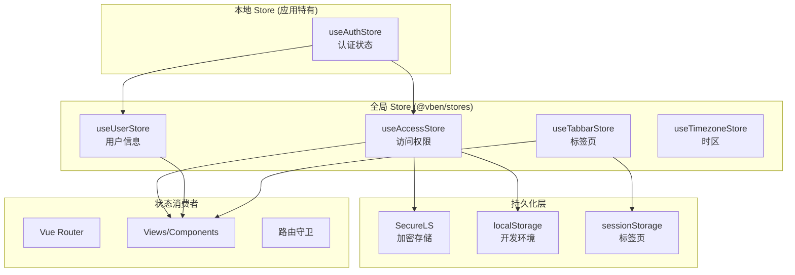
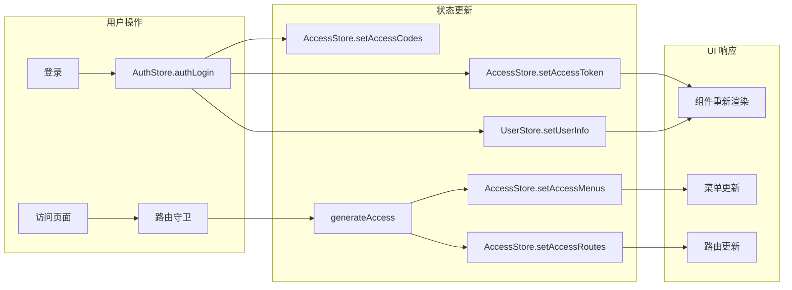
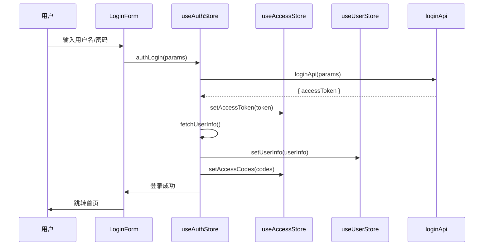

# 06 - 状态管理与数据流

## 6.1 状态管理架构



## 6.2 Store 模块划分

### 核心 Store (@vben/stores)

| Store | 文件 | 职责 | 持久化 |
| --- | --- | --- | --- |
| `useAccessStore` | `modules/access.ts` | Token、权限码、菜单、路由 | accessToken, refreshToken, accessCodes, isLockScreen |
| `useUserStore` | `modules/user.ts` | 用户信息、角色 | 否 |
| `useTabbarStore` | `modules/tabbar.ts` | 标签页、缓存、历史记录 | tabs, visitHistory (sessionStorage) |
| `useTimezoneStore` | `modules/timezone.ts` | 时区设置 | 是 |

### 应用 Store

| Store          | 文件                     | 职责                     |
| -------------- | ------------------------ | ------------------------ |
| `useAuthStore` | `apps/.../store/auth.ts` | 登录、登出、用户信息获取 |

## 6.3 AccessStore 详解

```typescript
// packages/stores/src/modules/access.ts
export const useAccessStore = defineStore('core-access', {
  state: (): AccessState => ({
    accessCodes: [], // 权限码列表
    accessMenus: [], // 可访问菜单
    accessRoutes: [], // 可访问路由
    accessToken: null, // 访问令牌
    isAccessChecked: false, // 是否已检查权限
    isLockScreen: false, // 锁屏状态
    lockScreenPassword: '', // 锁屏密码
    loginExpired: false, // 登录过期
    refreshToken: null, // 刷新令牌
  }),
  actions: {
    setAccessToken(token) {
      this.accessToken = token;
    },
    setAccessCodes(codes) {
      this.accessCodes = codes;
    },
    setAccessMenus(menus) {
      this.accessMenus = menus;
    },
    setAccessRoutes(routes) {
      this.accessRoutes = routes;
    },
    setIsAccessChecked(checked) {
      this.isAccessChecked = checked;
    },
    setLoginExpired(expired) {
      this.loginExpired = expired;
    },
    lockScreen(password) {
      this.isLockScreen = true;
      this.lockScreenPassword = password;
    },
    unlockScreen() {
      this.isLockScreen = false;
    },
  },
  persist: {
    pick: [
      'accessToken',
      'refreshToken',
      'accessCodes',
      'isLockScreen',
      'lockScreenPassword',
    ],
  },
});
```

## 6.4 UserStore 详解

```typescript
// packages/stores/src/modules/user.ts
interface BasicUserInfo {
  userId: string;
  username: string;
  realName: string;
  avatar: string;
  roles?: string[];
  [key: string]: any;
}

export const useUserStore = defineStore('core-user', {
  state: (): AccessState => ({
    userInfo: null,
    userRoles: [],
  }),
  actions: {
    setUserInfo(userInfo) {
      this.userInfo = userInfo;
      this.setUserRoles(userInfo?.roles ?? []);
    },
    setUserRoles(roles) {
      this.userRoles = roles;
    },
  },
});
```

## 6.5 TabbarStore 详解

```typescript
// packages/stores/src/modules/tabbar.ts
export const useTabbarStore = defineStore('core-tabbar', {
  state: (): TabbarState => ({
    cachedRoutes: new Map(),      // 缓存的路由组件
    cachedTabs: new Set(),        // 缓存的标签页
    tabs: [],                     // 标签页列表
    visitHistory: createStack(),  // 访问历史
    menuList: ['close', 'affix', 'maximize', 'reload', ...],
  }),
  actions: {
    addTab(tab) { /* 添加标签页 */ },
    closeTab(tab, router) { /* 关闭标签页 */ },
    closeLeftTabs(tab) { /* 关闭左侧 */ },
    closeRightTabs(tab) { /* 关闭右侧 */ },
    closeOtherTabs(tab) { /* 关闭其他 */ },
    pinTab(tab) { /* 固定标签页 */ },
    refresh(router) { /* 刷新标签页 */ },
  },
  persist: {
    pick: ['tabs', 'visitHistory'],
    storage: sessionStorage,  // 标签页不持久化到 localStorage
  },
});
```

## 6.6 持久化策略

### 初始化流程

```typescript
// packages/stores/src/setup.ts
export async function initStores(app: App, options: InitStoreOptions) {
  const pinia = createPinia();
  const { namespace } = options;

  // 使用 SecureLS 加密存储
  const ls = new SecureLSConstructor({
    encodingType: 'aes',
    encryptionSecret: import.meta.env.VITE_APP_STORE_SECURE_KEY,
    isCompression: true,
    metaKey: `${namespace}-secure-meta`,
  });

  pinia.use(
    createPersistedState({
      key: (storeKey) => `${namespace}-${storeKey}`,
      storage: import.meta.env.DEV
        ? localStorage // 开发环境用普通 localStorage
        : {
            getItem: (key) => ls.get(key),
            setItem: (key, value) => ls.set(key, value),
          },
    }),
  );

  app.use(pinia);
}
```

### 持久化配置

| Store | 持久化字段 | 存储介质 |
| --- | --- | --- |
| `useAccessStore` | accessToken, refreshToken, accessCodes, isLockScreen, lockScreenPassword | localStorage (加密) |
| `useTabbarStore` | tabs, visitHistory | sessionStorage |
| `useTimezoneStore` | timezone | localStorage (加密) |

## 6.7 数据流图



### 登录数据流



## 6.8 跨组件通信

### 方式一：Pinia Store（推荐）

```typescript
// 组件 A
const accessStore = useAccessStore();
accessStore.setAccessToken('xxx');

// 组件 B
const accessStore = useAccessStore();
watch(
  () => accessStore.accessToken,
  (token) => {
    console.log('Token changed:', token);
  },
);
```

### 方式二：依赖注入 (Provide/Inject)

```typescript
// 父组件
import { provide } from 'vue';
provide('userInfo', userInfo);

// 子组件
import { inject } from 'vue';
const userInfo = inject('userInfo');
```

### 方式三：Props/Events

```vue
<!-- 父组件 -->
<ChildComponent :value="value" @update="handleUpdate" />

<!-- 子组件 -->
<script setup>
defineProps<{ value: string }>();
defineEmits<{ update: [value: string] }>();
</script>
```

## 6.9 组件通信方式对比

| 方式 | 适用场景 | 优点 | 缺点 |
| --- | --- | --- | --- |
| Pinia Store | 全局状态、跨组件 | 响应式、持久化支持 | 过度使用导致耦合 |
| Provide/Inject | 主题、语言等全局配置 | 简洁 | 不适合业务状态 |
| Props/Emits | 父子组件通信 | 明确数据流 | 深层传递繁琐 |
| Vuex (已弃用) | - | - | - |

## 6.10 Store 初始化顺序

```typescript
// bootstrap.ts
async function bootstrap(namespace: string) {
  // 1. 初始化组件适配器
  await initComponentAdapter();

  // 2. 初始化表单组件
  await initSetupVbenForm();

  // 3. 国际化 i18n
  await setupI18n(app);

  // 4. 配置 Pinia Store (包括持久化)
  await initStores(app, { namespace });

  // 5. 安装权限指令
  registerAccessDirective(app);

  // 6. 配置路由
  app.use(router);

  // 7. 配置 Vue Query
  app.use(VueQueryPlugin);

  // 8. 配置 Motion 插件
  app.use(MotionPlugin);

  // 9. 挂载应用
  app.mount('#app');
}
```
