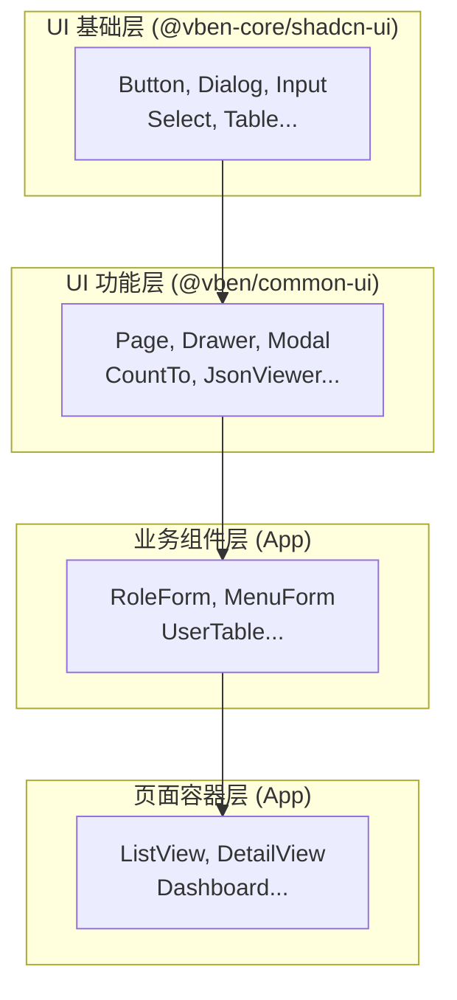
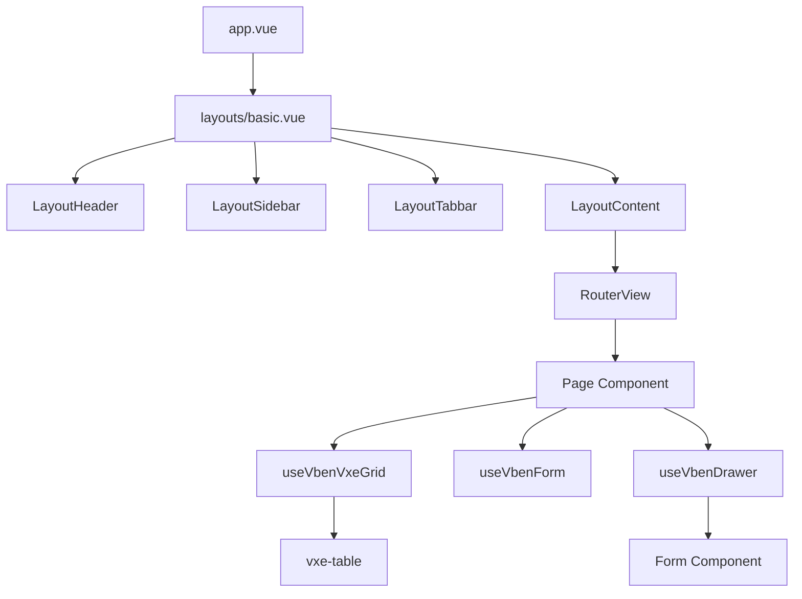
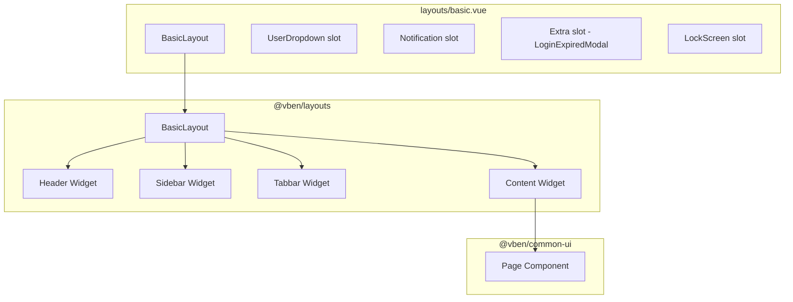

# 07 - 组件体系与 UI 规范

## 7.1 组件分层架构



## 7.2 UI Kit 结构

### @vben-core/shadcn-ui

基于 shadcn/ui 风格的基础组件：

| 组件类别 | 组件                                                 |
| -------- | ---------------------------------------------------- |
| **基础** | Button, Input, Textarea, Checkbox, Radio, Switch     |
| **布局** | Card, Accordion, Separator, Resizable                |
| **导航** | Tabs, Breadcrumb, DropdownMenu, ContextMenu          |
| **反馈** | Dialog, AlertDialog, Tooltip, Toast, Badge, Progress |
| **数据** | Table, Pagination, Avatar, Badge                     |
| **表单** | Form, Select, Label                                  |

### @vben-core/menu-ui

菜单相关组件：

```typescript
// packages/@core/ui-kit/menu-ui/src/components/
Menu; // 菜单根组件
MenuItem; // 菜单项
SubMenu; // 子菜单
NormalMenu; // 普通菜单模式
MenuBadge; // 菜单徽标
MenuBadgeDot; // 菜单徽标点
CollapseTransition; // 折叠动画
```

### @vben-core/layout-ui

布局相关组件：

```typescript
// packages/@core/ui-kit/layout-ui/src/components/
VbenLayout; // 根布局
LayoutHeader; // 头部
LayoutSidebar; // 侧边栏
LayoutContent; // 内容区
LayoutFooter; // 底部
LayoutTabbar; // 标签栏
```

## 7.3 通用组件 (@vben/common-ui)

### 核心组件

| 组件 | 说明 | 导出方式 |
| --- | --- | --- |
| `Page` | 页面容器组件 | `import { Page } from '@vben/common-ui'` |
| `Drawers` | 抽屉组件 | `import { useVbenDrawer } from '@vben/common-ui'` |
| `Modals` | 弹窗组件 | `import { useVbenModal } from '@vben/common-ui'` |
| `Form` | 表单组件 | `import { useVbenForm } from '@vben/common-ui'` |
| `Grid` | 表格组件 | `import { useVbenVxeGrid } from '#/adapter/vxe-table'` |

### 功能组件

| 组件           | 说明          |
| -------------- | ------------- |
| `CountTo`      | 数字滚动动画  |
| `JsonViewer`   | JSON 数据展示 |
| `Cropper`      | 图片裁剪      |
| `IconPicker`   | 图标选择器    |
| `Captcha`      | 验证码组件    |
| `EllipsisText` | 文本省略      |
| `Resize`       | 调整大小      |

## 7.4 组件通信方式

### Props/Events（父子通信）

```vue
<!-- 父组件 -->
<ChildComponent
  :value="value"
  :options="options"
  @change="handleChange"
  @click="handleClick"
/>

<!-- 子组件 -->
<script setup lang="ts">
defineProps<{
  value: string;
  options: Option[];
}>();
const emit = defineEmits<{
  change: [value: string];
  click: [event: MouseEvent];
}>();
</script>
```

### Provide/Inject（跨级通信）

```typescript
// 祖先组件
import { provide } from 'vue';
provide('theme', 'dark');
provide('updateTheme', (theme: string) => {
  /* ... */
});

// 后代组件
import { inject } from 'vue';
const theme = inject('theme');
const updateTheme = inject('updateTheme');
```

### Pinia Store（全局通信）

```typescript
// Store
const useUserStore = defineStore('user', {
  state: () => ({ name: '' }),
  actions: {
    setName(name: string) {
      this.name = name;
    },
  },
});

// 任意组件
const userStore = useUserStore();
userStore.setName('John');
```

## 7.5 组件复用机制

### Composables（组合式函数）

项目中的自定义 Hooks：

```typescript
// packages/effects/hooks/src/
useBeforeRender; // 渲染前回调
useWatermark; // 水印
useCountdown; // 倒计时
useCopyToClipboard; // 剪贴板
```

### Adapter 模式

组件适配器统一不同 UI 库的 API：

```typescript
// apps/.../adapter/
├── component/
│   ├── index.ts        # 组件映射
│   └── antd_use.ts     # Ant Design 懒加载
├── form.ts             # 表单适配
└── vxe-table.ts        # 表格适配
```

### 典型 Adapter 用法

```typescript
// form.ts - 表单适配
import type { VbenFormSchema } from '#/adapter/form';

// vxe-table.ts - 表格适配
import type { VxeTableGridOptions } from '#/adapter/vxe-table';
```

## 7.6 业务组件结构（CRUD 模式）

### 目录结构

```
src/views/{module}/{entity}/
├── data.ts              # 数据定义（列、表单 Schema）
├── list.vue             # 列表页面
└── modules/
    └── form.vue         # 表单组件
```

### data.ts 示例

```typescript
// src/views/system/role/data.ts
import type { VbenFormSchema } from '#/adapter/form';
import type { VxeTableGridOptions } from '#/adapter/vxe-table';

// 表格列定义
export function useColumns(): VxeTableGridOptions['columns'] {
  return [
    { field: 'name', title: '角色名称', width: 200 },
    { field: 'code', title: '角色编码', width: 150 },
    { field: 'status', title: '状态', width: 100 },
    { field: 'sort', title: '排序', width: 80 },
    { field: 'operation', title: '操作', width: 200, cellRender: { name: 'CellOperation' } },
  ];
}

// 表单 Schema
export function useFormSchema(): VbenFormSchema[] {
  return [
    { component: 'Input', fieldName: 'name', label: '角色名称', rules: 'required' },
    { component: 'Input', fieldName: 'code', label: '角色编码', rules: 'required' },
    { component: 'Select', fieldName: 'status', label: '状态', componentProps: { options: [...] } },
  ];
}
```

### list.vue 示例

```vue
<script lang="ts" setup>
import { Page, useVbenDrawer } from '@vben/common-ui';
import { useVbenVxeGrid } from '#/adapter/vxe-table';
import { getRoleList, deleteRole } from '#/api/system/role';
import { useColumns, useFormSchema } from './data';
import RoleForm from './modules/form.vue';

const [Grid, gridApi] = useVbenVxeGrid({
  formOptions: { schema: useGridFormSchema() },
  gridOptions: {
    columns: useColumns(),
    proxyConfig: {
      ajax: {
        query: async ({ page }, formValues) => {
          return await getRoleList({ page: page.currentPage, ...formValues });
        },
      },
    },
    rowConfig: { keyField: 'id' },
  },
});

const [Drawer, drawerApi] = useVbenDrawer({
  connectedComponent: RoleForm,
});

function handleEdit({ row }) {
  drawerApi.open({ id: row.id });
}
</script>

<template>
  <Page>
    <Grid />
    <Drawer />
  </Page>
</template>
```

## 7.7 UI 规范

### 命名规范

| 类型     | 规范       | 示例                   |
| -------- | ---------- | ---------------------- |
| 组件文件 | PascalCase | `RoleList.vue`         |
| 组件目录 | PascalCase | `FormDrawer/`          |
| Hooks    | camelCase  | `useCountdown.ts`      |
| 工具函数 | camelCase  | `download-helper.ts`   |
| 类型定义 | PascalCase | `UserInfo`, `RoleItem` |

### 组件导出规范

```typescript
// 使用命名导出
export { Page, useVbenDrawer, useVbenModal };
export type { PageProps };

// 使用默认导出（仅限叶子组件）
export default Button;
```

### 样式规范

- 使用 Tailwind CSS 进行样式开发
- 组件内部使用 SCSS 时遵循 BEM 命名
- 避免使用行内样式（除动态值）

## 7.8 组件树结构



## 7.9 布局组件层次



## 7.10 组件懒加载

### 路由懒加载

```typescript
// 路由配置中
const routes = [
  {
    path: '/system/role',
    component: () => import('#/views/system/role/list.vue'),
  },
];
```

### 组件懒加载（antd_use.ts）

```typescript
// apps/.../adapter/component/antd_use.ts
export async function lazy_use_components(app: App) {
  const components = [
    Button,
    Input,
    Select,
    Tree, // ...
  ];
  for (const component of components) {
    app.component(component.name!, component);
  }
}
```

## 7.11 权限指令

```typescript
// v-access 指令使用
<template>
  <button v-access="'system:role:add'">添加角色</button>
  <div v-access="'system:role:view'">角色列表</div>
</template>

// 注册方式 (bootstrap.ts)
import { registerAccessDirective } from '@vben/access';
registerAccessDirective(app);
```
